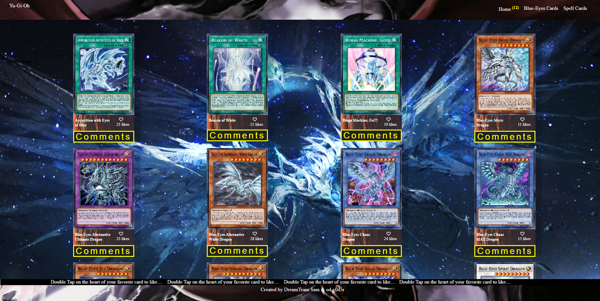

# Aplicativo Yu-Gi-Oh 

> Este aplicativo exibe uma série de cartões com base onde um usuário pode clicar em cada um dos cartões para curtir seu cartão favorito. O aplicativo também possui um link para a seção de comentários que, quando clicado, leva o usuário a um pop-up da seção de comentários contendo informações mais detalhadas sobre o cartão. Nesta seção, o usuário também pode deixar um comentário com base na experiência e nas dúvidas que possa ter. Ambas as páginas possuem contadores para exibir a quantidade de comentários e itens na tela.

> Yu-Gi-Oh é uma série de mangá japonesa sobre jogos de cartas colecionáveis ​​escrita e ilustrada por Kazuki Takahashi. Foi serializado na revista Weekly Shōnen Jump da Shueisha entre setembro de 1996 e março de 2004. O enredo segue a história de um menino chamado Yugi Mutou, que resolve o antigo Enigma do Milênio. Yugi desperta um alter ego ou espírito de jogo dentro de seu corpo que resolve seus conflitos usando vários jogos.

## Captura de Tela do Projeto



Descrição adicional sobre o projeto e suas características.

## Demonstração Ao Vivo

[Live Demo Link](https://mosams.github.io/Yu-Gi-Oh_Cards_App/dist/)

## Construído Com

- HTML
- CSS
- JAVASCRIPT
- WEBPACK

### Usano Localmente

- Clone o projeto do GitHub [here](https://github.com/Mosams/Yu-Gi-Oh_Cards_App.git)
- Execute os seguintes comandos listados em seu terminal:
- `npm install`
- `npm run build`
- `npm start`

### Execute Testes
- `npm test`

## Como Configurar

> Você pode simplesmente clonar ou baixar [this repository](https://github.com/Mosams/Yu-Gi-Oh_Cards_App.git), e usar seu navegador ou editor de código favorito para executar este programa.

- Para abrir o projeto após o download, basta clicar duas vezes no arquivo index.html

- Para abrir este projeto usando vs code (neste exemplo) ou seu editor de código favorito, você pode seguir o guia abaixo:
  > Em seu cmd ou linha de comando navegue até onde este projeto está localizado, então;

```cmd
cd Yu-Gi_Oh_Cards_App
```

> Depois Disso, execute

```cmd
code .
```


